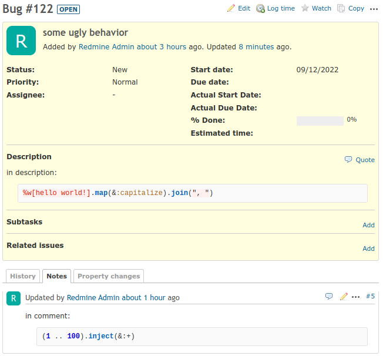
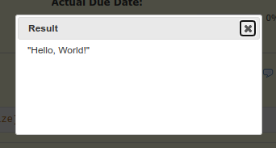
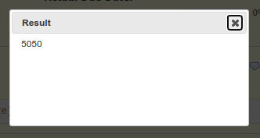

# Redmine ruby.wasm plugin: A plugin to run Ruby code on Redmine

[](https://raw.githubusercontent.com/nishidayuya/redmine_ruby_wasm/master/LICENSE.txt)
[](https://github.com/nishidayuya/redmine_ruby_wasm/tags)
[](https://app.circleci.com/pipelines/github/nishidayuya/redmine_ruby_wasm)

## Screenshot

In Redmine's issue page:



After click Ruby code on description:



After click Ruby code on comment:



## Installation

Clone the plugin into your Redmine plugins directory.

```console
$ cd /path/to/redmine/plugins/
$ git clone https://github.com/nishidayuya/redmine_ruby_wasm.git
```

And restart your Redmine.
